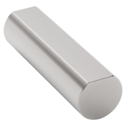
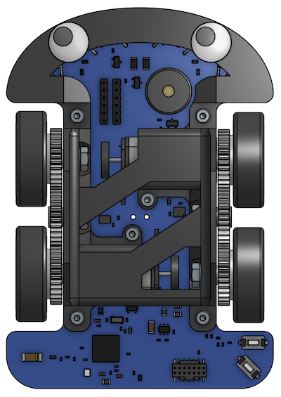
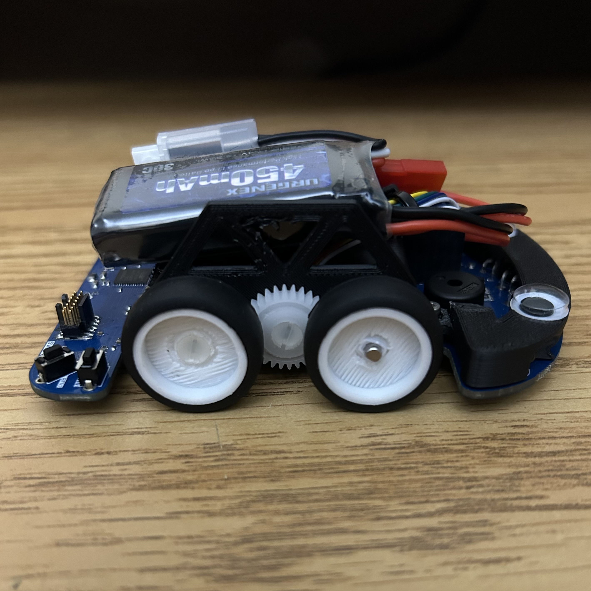

# Drivetrain

## Wheels and Axles

Wheels are simple. You can use big wheels or small wheels. The circumference of your wheel should be considered when selecting your motor to determine what RPM and Torque you need (see [Selecting a Motor](motors-and-encoders.md#selecting-a-motor)).

{ width=150 align=right }

The most important thing to consider is how your wheel will attach to your drive axle/motor shaft. At the scale of MicroMouse, options are limited. 

### D-Shafts

Many MicroMouse robots use D-shafts and a specialized wheel to fit it snugly. The popular [gearmotor](motors-and-encoders.md#gearmotor-w-extended-back-shaft-and-hall-effect-encoder) has a D-shaft.

!!! tip
    Normal round shafts can be turned into D-shafts with a metal file and some determination!

It will be challenging to find COTS wheels that will work perfectly with a D-shaft. Instead, we recommend 3D printing wheels instead and buying tires separately. There are many RC car tires on Amazon that will work.

### Using Bolts as Axles

Some MicroMouse robots use bolts as axles. Simply slide a wheel onto a bolt and secure it to a bearing with a nut, preferably a nylon lock nut. 

## Gears

If you plan to use gears in your drivetrain, we recommend buying Acetal gears from a site like [McMaster-Carr](https://www.mcmaster.com/gears).

3D printing gears is possible, but they will not be very precise and will wear down quickly.

## Example Drivetrain Configuration

{ width=212 }
{ width=300 }

The MicroMouse seen above uses gearmotor with a D-shafts to drive the front right and back left wheels. The center gears, front left wheel, and back right wheel use nylon M3 bolts as axles with M3 nylock nuts to secure them to the bearings. Gears are Acetal gears purchased from McMaster-Carr, and the wheels are 3D printed.

This motor configuration is very uncommon. Normally, motors are placed back to back. However, this configuration allows for a smaller robot width to allow for diagonal driving.

