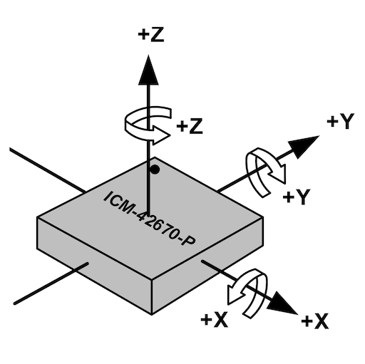

# IMU

{ width=200 align=right }

An Inertial Measurement Unit (IMU) consists of a Gyroscope and an Accelerometer in one small package. An IMU can be used to measure your robot’s angular velocities (roll, pitch, and yaw), and its linear accelerations (X, Y, and Z). Some MicroMouse robots do not have an IMU, since the essential information (yaw velocity, forward acceleration) can be derived from wheel encoder readings.  

For most robots, this method of only using encoders works fine. However, high-speed robots will benefit from having an IMU because encoder readings can become inaccurate when tires slip. Adding a second measurement input to your robot’s odometry and PID controllers can only improve its consistency.  

!!! note
    Do not spend lots of money for a super accurate IMU. With proper filtering, most low-end IMUs will suffice. Remember, your robot’s IMU just needs to be good enough to supplement your encoders. 

IMUs can also be useful for detecting crashes. Sudden spikes in pitch and roll velocities could indicate that the robot has flipped over. A sudden negative forward acceleration could indicate that the robot has crashed into a wall. 

