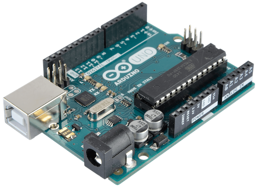
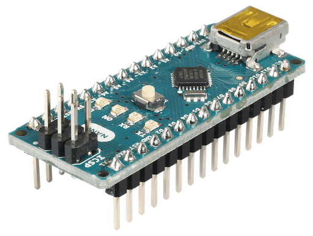
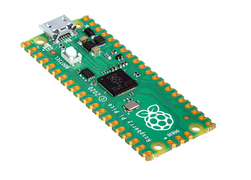
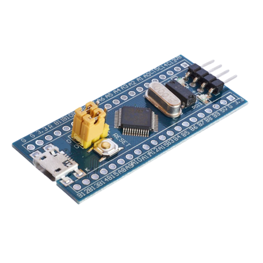

# Microcontroller

There are many, many microcontrollers that can be used for MicroMouse robots. Which one you select will usually come down to availability or personal preference. 

In general, you should not feel the need to get the fastest or most "powerful" MCU you can find, since your MicroMouse code is not likely to be very processor-intensive unless you plan to perform image processing or something. There are plenty of exceptional MicroMouse robots using just an Arduino Nano that have no problems with processing speed.

## Arduino 

{ width=200 align=right }
{ width=200 align=right }

If this is your first MicroMouse, consider using an Arduino. Arduinos are easy to use and have tons of online documentation. You will be able to find code examples online for almost any hardware component you need to interface with. Arduinos also come in all different shapes and sizes and with different features, so you can choose the model that best suits your robot's needs. 

Our club has a ton of Arduinos in stock, so you can get started experimenting with them in no time.

## Raspberry Pi Pico 

{ width=200 align=right }

Raspberry Pi Picos are small boards based on the RP2040 MCU. Picos are close in size to Arduino Nanos, but are more powerful and featureful. One special feature for Picos is that they officially support MicroPython, a subset of Python 3 designed to run efficiently on microcontrollers. Alternatively, Picos can also be programmed in C or C++ like Arduinos.  The RP2040 has two processing cores, which can be used however you want for parallelizing your robot program. Pico W models come with Wi-Fi support, which may come in handy when debugging (not allowed at competitions though).

Our club also has many Raspberry Pi Picos in stock.

## STM32 

{ width=200 align=right }

If you want something more advanced, consider using an STM32. STM32s are a great choice of MCU if you are designing your own PCB, since you can choose the variety that best suits your robot. You can find STM32s that are low-power, ones that have lots of IO, or ones with wireless capabilities. 

You can also find premade Nucleo or Blue Pill boards for sale that use STM32s if you don’t want to design something custom. 

STM32s are notoriously much more difficult to program compared to an Arduino, but ST’s CubeIDE/CubeMX are helpful tools to get started.

## ESP32 

We have not had anybody from this club use an ESP32 chip before; however, they are a perfectly viable MCU option for MicroMouse robots. Many ESP32 chips come with Wi-Fi or Bluetooth capabilities that may be handy for debugging.

