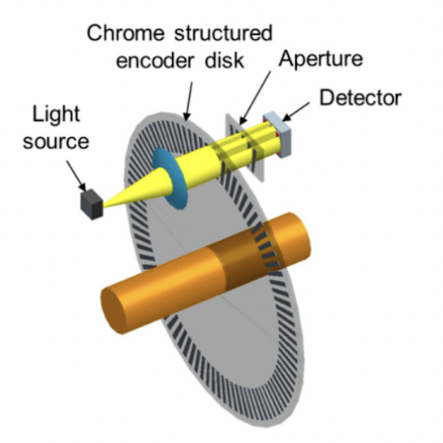

# Motors and Encoders

## Selecting a Motor

There are several factors to consider when selecting a motor:

1. Motor Type
2. Voltage + Current Draw
3. RPM + Torque
4. Encoder Compatibility

### Motor Type

There are two main types of DC motors: brushed and brushless.
Without going into the specifics of how they work, here's a brief description of both kinds:

1. Brushed Motors
    - Cheap and easy to find
    - Easily controlled by varying the voltage supplied to them. An H-bridge can be used for this
    - Do not include any sensors to determine their position or speed — an external sensor (like an encoder) is required

2. Brushless Motors (BLDC)
    - Expensive
    - Require a specialized controller (ESC) to control them
    - Typically include an internal encoder that can be used to determine their position and speed

For MicroMouse, we recommend using brushed DC motors — you really do not need the extra complexity of brushless motors. For the most part, this wiki will focus on brushed DC motors. If you choose to use a BLDC motor, I assume you know what you are doing.

### Motor Voltage + Current Draw

You should have already figured out which battery you are using and how your motors will be powered (see [Battery & Power Distribution](battery-and-power-distribution.md)).  

The voltage listed in the description of a motor is typically its max voltage. For normal brushed DC motors, it is fine to run them slightly below their listed voltages (they will just be slower). 
If you are using a BLDC, be careful with how you power it because they usually have strict requirements. Make sure that you follow its instructions well. 

Another essential consideration is the current draw of your motors. In the datasheet for your motor, look for a value named "stall current". This is the maximum current that the motor will draw (when it is stalled, producing its maximum torque). Make sure your robot's power distribution system can handle this (while powering other components too!). If you are very limited and cannot always guarantee that your power distribution system can supply enough current, consider adding a fuse to protect your motors and other components from damage in case of a stall.

### RPM + Torque

To determine the RPM you need from your motors, first determine the maximum speed you want your MicroMouse to travel at. For most robots, 1 m/s is a good upper limit. Some advanced MicroMouse robots may go upwards of 3 m/s.

Next, determine the wheel diameter you will be using.

With these values, you can calculate the RPM you need from your motors using the following formula:

\[
\text{RPM} = 60 \times \frac{\text{velocity}}{\pi \times \text{wheel diameter}}
\]

If you are planning to gear down your motors, make sure to account for that as well.

Note that the RPM listed in a motor's description is usually its maximum free-spinning RPM. When under load (moving your robot), its RPM will be lower. When selecting a motor, choose one that is rated for a higher RPM than you need, maybe 20-30% higher.

???+ example
    $ \text{wheel diameter} = 5 \text{ cm}$

    $ \text{maximum velocity} = 100 \text{ cm} /\text{s}$

    $ \text{motor speed} = 60 \times \frac{100}{\pi \times 5} = 382 $ RPM

    In this case, you will need a motor that can provide at least 382 RPM under load. Using a motor with a free-spinning speed of 500-600 RPM might be a good choice.

## Encoders

Encoders are essential for precise control of your robot. In certain cases, they can be omitted in lieu of a super accurate IMU or an amazing vision system, but chances are you do not want to go down that road.

Encoders provide information about the velocity of your motors and distance traveled. Without them, it is very difficult to control your robot's speed and position accurately.

There are two main types of encoders: optical and hall effect.

### Optical Encoders

{ width=200 align=right }

Optical encoders work by spinning a disk with slits in it, then shining a light through the disk and checking whether the light passes through or not. As it rotates, your MCU can count pulses from the encoder to determine how far the motor has turned. See [Using Quadrature/Incremental Encoders](#using-quadratureincremental-encoders).

### Hall Effect Encoders

{ width=200 align=right }

Hall effect encoders work by spinning a magnet with radially alternating poles past a hall effect sensor.  The sensor detects the change in magnetic field as the magnet passes by and sends a pulse to your MCU. As with optical encoders, you can count these pulses to determine how far the motor has turned. See [Using Quadrature/Incremental Encoders](#using-quadratureincremental-encoders).

Hall effect encoders are usually smaller than optical encoders, making them a good choice for MicroMouse robots. They are also generally more reliable. However, the precision of hall effect encoders is limited by the number of radial poles on the magnet.

### Encoder Precision

Typically, the greatest number of radial poles that you can find on a magnet small enough for MicroMouse is 6. Optical encoder disks may have double that number of slits.
A good way to gauge encoder precision is by calculating the distance that the robot travels per encoder pulse.

\[
\text{distance per pulse} = \frac{1}{\text{pulses per revolution}} \times \text{wheel diameter} \times \pi
\]

??? example "Example"
    $ \text{encoder pulses per revolution} = 6$

    $ \text{wheel diameter} = 5 \text{ cm}$

    $ \text{distance per pulse} = \frac{1}{6} \times 5 \times \pi = 2.62 \text{ cm}$

Remember that MicroMouse robots are very small — the size of a maze cell is only 18 cm. Using an encoder attached directly to your robot's wheels with only 6 pulses per revolution will not provide enough precision for most robots, especially if the robot is using large wheels. To improve the precision, consider gearing your drivetrain in such a way that your robot's wheels rotate slower than your encoders. These [gearmotors](#gearmotor-w-extended-back-shaft-and-hall-effect-encoder) described later make this easy.

??? example "Revised Example with Gear Ratio"
    $ \text{wheel diameter} = 5 \text{ cm}$

    $ \text{gear ratio} = 40:1$

    $ \text{encoder pulses per revolution} = 6 \times 40 = 240$

    $ \text{distance per pulse} = \frac{1}{240} \times 5 \times \pi = 0.07 \text{ cm}$

    Compared to the previous example, this drivetrain is considerably more precise with a distance per pulse less than 1 mm. Excellent.

    { width=100 }

### Using Quadrature/Incremental Encoders

Most encoders are "quadrature" or "incremental" encoders which have two output channels (A and B).
If your encoder instead uses an I2C or SPI interface, refer to the manufacturer's documentation for how to use it.

For hall effect encoders, channels A and B typically correspond to two hall sensors placed 90 degrees out of phase with each other. These signals will tell you whether the sensor is seeing a north or south pole of the magnet. As the magnet spins, your MCU can count the pulses of these signals to determine how far the motor has turned. To determine the direction of rotation, check which channel is leading the other, like so:

On your MCU, you can use external interrupts to trigger when the channels change state. However, your encoders will likely be spinning very fast — potentially faster than your MCU can keep up with. Instead, (if your MCU supports it) consider using hardware timers to count the encoder pulses for you. Then your code just need to read the timer value whenever it needs encoder information. STM32s are awesome at this.

## Good MicroMouse Motors and Encoders

### Gearmotor w/ Extended Back Shaft and Hall Effect Encoder

Many MicroMouse robots use this geared brushed DC motor + Hall Effect encoder combo:

{ width=200 align=right }

These motors have a few benefits:

1. Small size
2. Cheap
3. Available with a variety of gear ratios — good for fast or slow robots
4. D Shaft, easy to attach wheels
5. Easy encoder integration (before gearing, so high precision)
6. Relatively easy to mount (you must 3D print a part to clamp the geared area)
7. Available in many different voltages (3.3V, 6V, 12V)

If you choose this route, you _might_ be able to buy the motor with an encoder pre-attached, but most likely you will need to buy them separately and solder them together yourself.

For the motor, make sure you buy one with an "extended back shaft" — this is essential for mounting the encoder. 50:1 is a good gear ratio for most MicroMouse robots. If you have a need for speed, consider 30:1 or 20:1.

For the encoder, you can find "regular" ones which stick out the flat side of the motor (see the image above), or "sideways" ones that go the other way. Choose whichever one better fits your robot.

Some encoders come with JST connectors. These connectors can be handy; however, they are not meant for frequent plugging and unplugging because the pins bend very easily. If you want to aviod this headache, buy ones that you can solder wires to yourself.

Links: 

- Digikey: [50:1 Motor](https://www.digikey.com/en/products/detail/pololu/3073/10450075), [Regular Encoder (2-pack)](https://www.digikey.com/en/products/detail/pololu/3081/10450612) 
- Pimoroni: [Motor](https://shop.pimoroni.com/products/micro-metal-gearmotor-extended-back-shaft?variant=3073681025), [Regular Encoder (2-pack)](https://shop.pimoroni.com/products/micro-metal-motor-encoder?variant=39888423321683), [Sideways Encoder (2-pack)](https://shop.pimoroni.com/products/micro-metal-motor-encoder?variant=39888423354451) 

### Faulhaber 1717SR Series Motor

Many top MicroMouse robots use these Faulhaber 1717SR series motors (1717T003SR for 3V or 1717T006SR for 6V) combined with an IE2-512 encoder. These motors and encoders are very small and considerably powerful; however, they are quite expensive ($200+ each).  

Links: 

- [1717T003SR](https://www.faulhaber.com/en/products/series/1717sr/#37005) 
- [IE2-512](https://www.faulhaber.com/en/products/series/ie2-1024/#2851)

## Controlling Brushed DC Motors

To adjust the speed of a brushed DC motor, you must adjust the voltage supplied to it (e.g. for a 5 V motor, 5 V is full speed, 0 V is stopped, and 2.5 V is half speed). To change a motor's direction, flip its polarity.

{ width=300 align=right }
{ width=300 align=right }

Normally it is difficult to produce a variable voltage to control motors, so most applications use PWM (Pulse Width Modulation) to simulate a lower voltage by switching from high voltage to low voltage at a high frequency. Depending on the duty cycle of the PWM signal (percent time high during one cycle), the resulting average voltage will change.

Almost all modern MCUs (Arduino, STM32, etc.) can output a PWM signal from at least a few of its pins. However, these pins cannot supply enough current to directly power a motor. H-Bridge motor controllers solve this problem by providing an easy way to use an alternate power source to power motors.  

H-Bridge motor controllers typically come in one of two (sometimes both – you choose) control methods: IN/IN or PHASE/ENABLE (I’m using TI’s terminology here, might be described differently in other places). For IN/IN, the H-Bridge has two PWM inputs, one for forward speed and the other for reverse speed. PHASE/ENABLE on the other hand has two inputs: PHASE controls the direction of the output, and ENABLE controls whether it is on/off, which you can control using PWM to adjust the speed of the motor.

MicroMouse robots typically have two motors, so instead of getting two H-Bridge components for your robot, look for a single "Dual H-Bridge" component that integrates two H-Bridges into one small package. 

??? question "Joke: Why was the PWM wire always calm and collected?"
    Because it knew how to keep its pulse under control!
