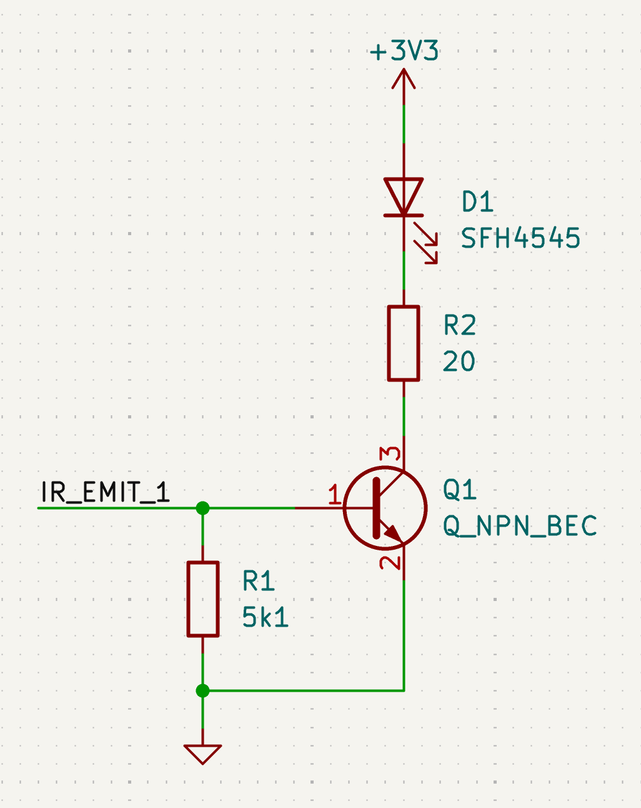
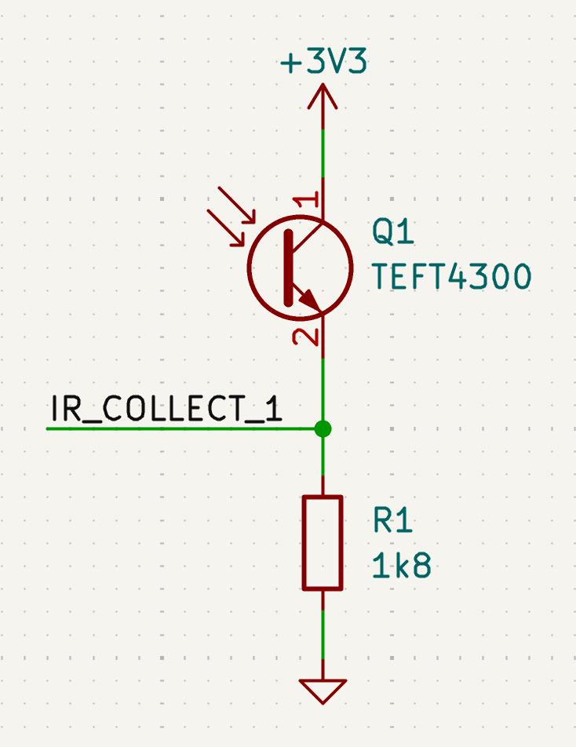
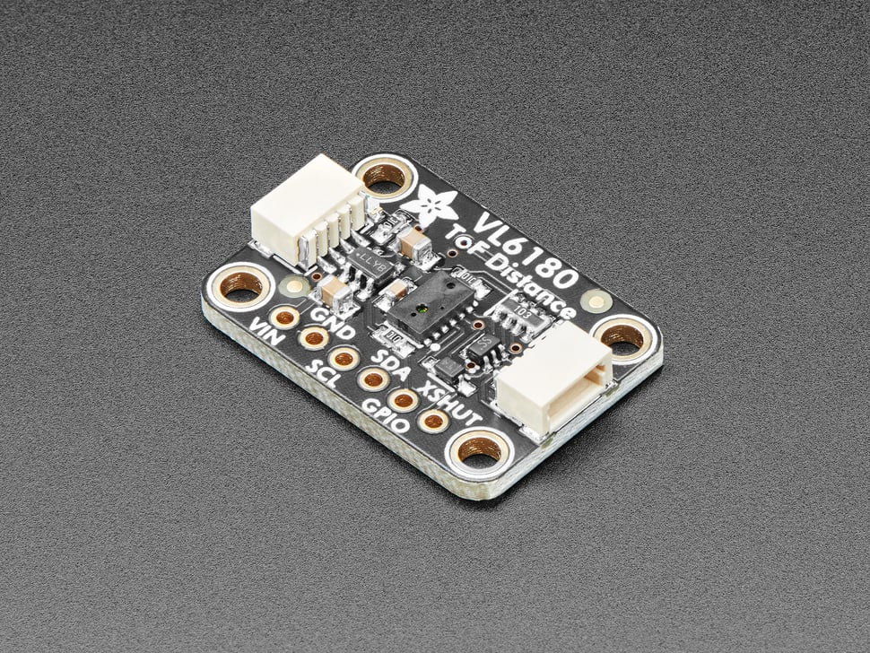

# Wall Sensors

Every MicroMouse must have sensors to detect the maze walls. You can get creative with this, as there are many perfectly reasonable solutions. 

!!! note
    For the most part, everything described in this section will focus on robots that use simple distance sensors to detect nearby walls while navigating through the maze. If you plan to use a camera or some other wacky method instead, I assume you know what you are doing. 

The sensor choices you make here will impact how you navigate through the maze, see [Navigation](../software/robot-control-and-navigation.md) for details about that.

Your MicroMouse should be able to detect at least the wall in front of it, and the walls to the left- and right-hand sides (unless you want to only use the front sensor and spin around in every cell; I don’t recommend it, but I won’t stop you).

When selecting sensors, determine whether you need a distance reading or just a binary 1 or 0 indicating whether a wall is present. Either option will work, but distance sensors will allow your robot navigate better.

Below is a description of some common sensor types used in MicroMouse robots. Other types may also work.

## IR Sensors

{ width=200 align=right }
{ width=200 align=right }

IR sensors are commonly used by MicroMouse robots because they are small and can provide a relatively consistent distance reading. You can also use them digitally to simply check the presence of a wall. IR sensors have two parts: an emitter and a receiver. The emitter sends out a beam of infrared light. When a wall is present that light bounces off the wall and can be detected by the receiver.

IR sensors can be complicated to get set up. You _might_ be able to find a part that contains both the emitter and the receiver, but most likely you will need to source your own IR emitter and phototransistor separately. It is important to buy parts that are compatible with each other – the wavelength of the emitter should fall within the detectable range of the phototransistor. Ideally, the detectable range of your phototransistor should be small to avoid it from being affected by ambient light. 

Wiring the emitters is straightforward, just connect them to VCC and GND, making sure to not give them more voltage than they can handle. While this alone will work, it is also usually a good idea to add a simple transistor controllable from your robot's MCU to turn the emitters on/off. See the schematic below for an example of how to do this. Being able to turn off emitters is beneficial for two reasons. First, it saves battery life and reduces your current draw. Each emitter may draw 100mA of current, so only enabling one at a time will reduce the strain on your power supply. Second, enabling all four sensors at once will likely produce bad readings from your phototransistors, since light from other emitters may be picked up by the wrong receivers. In code, you should loop through each sensor and enable only one emitter at a time, then take the reading from its associated phototransistor. Once finished, turn off the emitter and then move on to the next one in the loop. 

{ width=300 }

Wiring the phototransistors can be more complicated. Phototransistors essentially act as a resistor that varies resistance based on how much IR light it detects. With this, you can create a [Voltage Divider](https://en.wikipedia.org/wiki/Voltage_divider) to produce a voltage that can be read by your MCU. See the schematic below for an example. Note that this output is an analog signal, which is different from the typical digital signals that most sensors produce. Some MCUs may have a built-in [ADC](https://en.wikipedia.org/wiki/Analog-to-digital_converter) (analog to digital converter) that can operate on a few input pins (most STM32 and ESP32 chips have one). Some Arduino boards do not have an ADC, so you’ll need a separate ADC component that will convert the signals from your sensors to a PWM signal or provide an I2C interface. If you choose not to use an ADC, you can treat the output of your phototransistor circuit as a digital (1/0) signal to check for the presence of a wall with no distance information. You will need to tune your voltage divider based on the trigger voltage of your MCU’s pins.

{ width=300 }

Readings from IR phototransistors are not trivial to deal with for several reasons. To start, readings do not increase linearly with distance, instead they follow the inverse square law ($1/d^2$). Next, IR sensors may produce different readings in different environments or with different wall materials. Readings also may vary slightly from sensor to sensor. For these reasons, it is important to "calibrate" your sensors before traversing the maze. Your robot can perform a calibration on your left and right sensors at startup if it is able to see both side walls of the current cell. 

A popular emitter/phototransistor combo used by many MicroMouse robots is the SFH4545 + TEFT 4300

## Time-of-Flight Sensors

{ width=200 align=right }

Time of Flight sensors are advanced components that can provide your robot with very precise distance measurements. ToF sensors work by emitting a laser beam and then determining the distance to nearby objects based on the time it takes to bounce back. ToF sensors are normally more expensive than other sensors and usually draw more current. However, ToF sensors are the best option if your MicroMouse needs to look very far in front or requires very reliable and consistent readings. 

ToF sensors are usually very easy to use. You can buy a board from Adafruit or design your own circuit following the instructions from the ToF sensor's datasheet. Most ToF sensors provide an I2C interface, some may be SPI. Conversion to physical units (mm) is done on-device, making it easy to get readings. You do not need to do any sort of "calibration" like IR sensors – these sensors are calibrated at the factory and will not be affected too much by ambient light. 

## Ultrasonic Sensors

Ultrasonic sensors are a good sensor choice for simple MicroMouse robots. Ultrasonic sensors can be very bulky, but they will provide consistent distance readings and are easy to wire and use. Ultrasonic sensors typically output a low frequency PWM signal that can be easily read by your MCU. These are a good option for Arduino-based robots.

